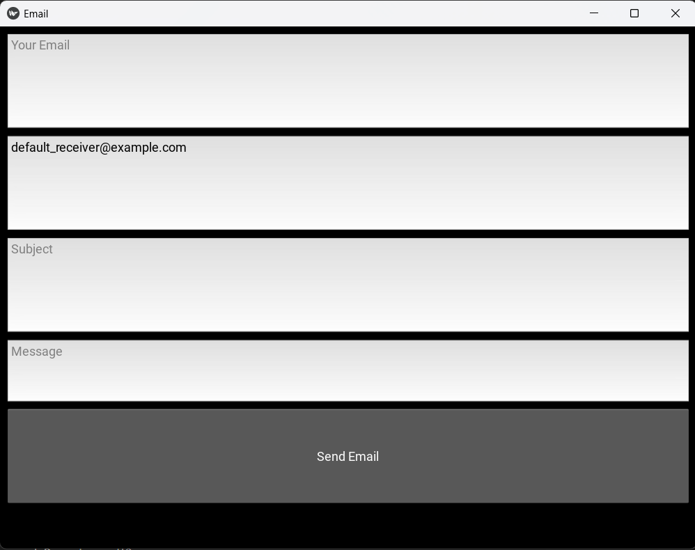

# Email Sender App

A simple GUI-based email sender application using Kivy and Yagmail.

## Details

This application provides an interface to send emails using the Gmail platform. The backend logic uses the `yagmail` library, and the GUI is built using the `kivy` framework.

### Modules to Install
- kivy: For the GUI : pip install kivy
- yagmail: For sending emails through Gmail : pip install yagmail

## Features
- Simple and intuitive GUI.
- Ability to input sender email, receiver email, subject, and message.
- Email format validation.
- Status notifications for successful sends and errors.

## Getting Started
- Clone the repository:git clone:  https://github.com/Bisalkumar/Email_Sender.git
- Navigate to the repository directory and install the required modules: pip install -r requirements.txt
- Run the application: python Sending_Emails.py

## How to Use
1. Input your email in the Your Email field.
2. Input the receiver's email in the Receiver Email field. Defaults to default_receiver@example.com.
3. Add the subject of your email.
4. Type your message.
5. Click the Send Email button.

## Screenshots

## Contributions
Pull requests are welcome! For major changes, please open an issue first to discuss what you'd like to change.

## License
This project is licensed under the MIT License - see the LICENSE.md file for details.

## Acknowledgements
Kivy - The open-source Python library for developing multitouch applications.
Yagmail - Making it easier to send and receive emails with Python.